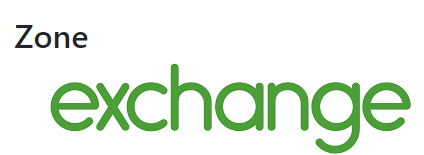
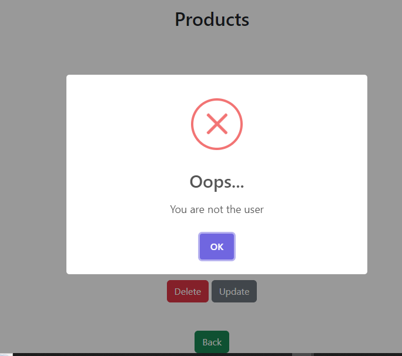
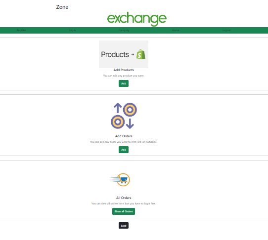
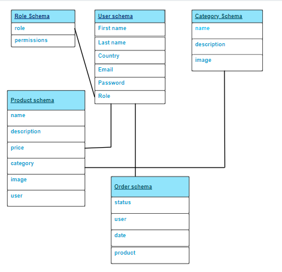

<p align="center">
<a href="https://www.meraki-academy.org" target="_blank" rel="noopener noreferrer">
 
 </a>
</p>

<h3 align="center">Exchange Zone
</h3>

---

<p align="center">
     Exchange Zone is an item exchange application, where offers adding products for multiple categories. Moreover, adding orders for rent, sell and even exchange.

    
</p>

## 📝 Table of Contents

- [About](#about)
- [Getting Started](#getting_started)
- [Usage](#usage)
- [Built Using](#built_using)
- [User Story](#user_story)
- [Data Flow](#data_flow)
- [Guided By](#guided_by)

## 🧐 About <a name = "about"></a>


 Are you looking for an app combines between item exchange  and E-commerce? we provide an excellent app that goal to enhance the community awareness by exchange goods instead of discarding them. The exch is the greatest and most accurate application to do this for you. It helps you to exchange old goods.  Exchange useless things you have with what ever you want, remember things that you think are useless, others deem valuable.
 The Exchange zone provides a simple design to ensure having the best user experience.

## 🏁 Getting Started <a name = "getting_started"></a>

These instructions will get you a copy of the project up and running on your local machine for development and testing purposes.

### Prerequisites

- Visual Studio Code follow this <a href='https://code.visualstudio.com/download'>link</a> to install.
- Git Bash follow this <a href='https://git-scm.com/downloads'>link</a> to install.
- MongoDB follow this <a href='https://www.mongodb.com/try/download/community-kubernetes-operator'>link</a> to install.
- Node.js follow this <a href='https://nodejs.org/en/download'>link</a> to install.

### Installing:

1. Clone the repo to your local machine using git bash.

```
git clone https://github.com/your_username_/Project-Name.git
```

2. Install packeges repeat this step in backend and frontend folder

```
npm i
```
3. You have to install sweetalert2, react-bootstrap, jwt-decode

```
npm i sweetalert2  react-bootstrap  jwt-decode
```
4. Run server using git bash inside backend folder

```
npm run dev
```

5. Run application using git bash inside frontend folder

```
npm run start
```

Now app ready to use

## 🎈 Usage <a name="usage"></a>


- You don't have to register to see the main features of our app.
- You can't add, update or remove any category of our app, you will found all the categories you want, you can add update or remove products in the categories.
- You can't  update or remove any orders or products if you are not the owner.


- You can click on the **Home** tab provided in the navigation bar to view the home section, so you can add product and orders, also show all orders.


- You can click on the **Category** tab provided in the navigation bar to view the category section, which contain all the categories and simple description.


## ⛏️ Built Using <a name = "built_using"></a>

- [MongoDB](https://www.mongodb.com/) - Database
- [Express JS](https://expressjs.com/) - Server Framework
- [React JS](https://https://reactjs.org/) - Web Framework
- [Node JS](https://nodejs.org/en/) - Server Environment

## User Story <a name = "#user_story"></a>

You can view the details of trello board below:
<br/>
<a href='https://trello.com/b/gEKgHjeX/project-4'>Trello</a>

## Data Flow <a name = "#data_flow"></a>

</a>

## ⚠️ Guided By <a name = "guided_by"></a>

This project is guided by ©️ **[MERAKI Academy](https://www.meraki-academy.org)**